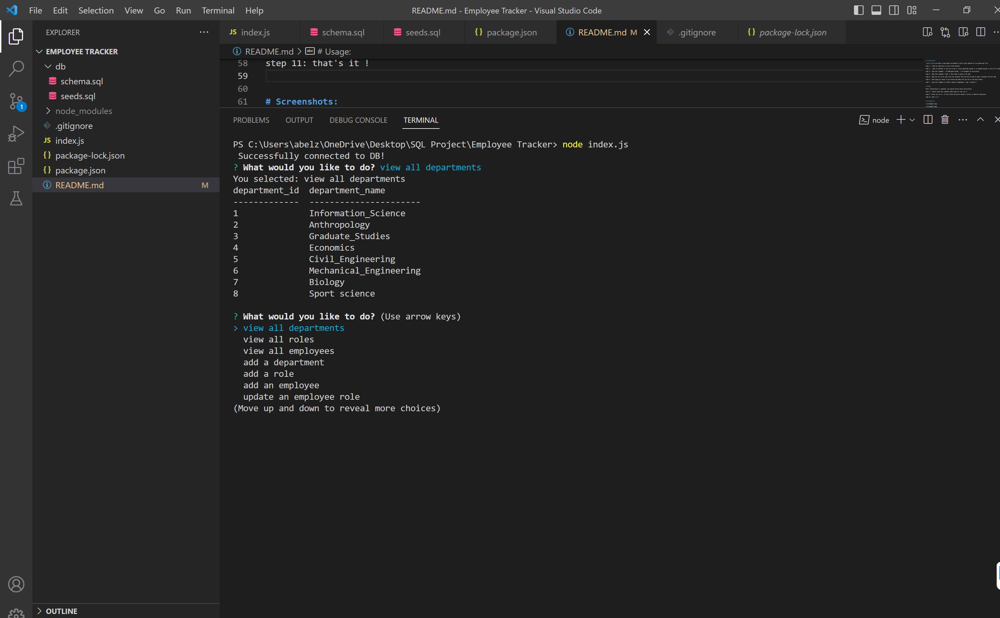
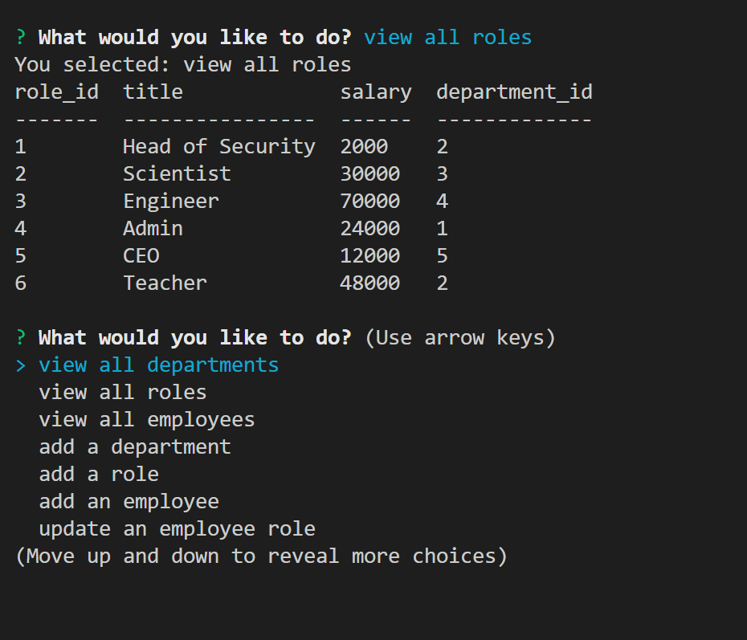
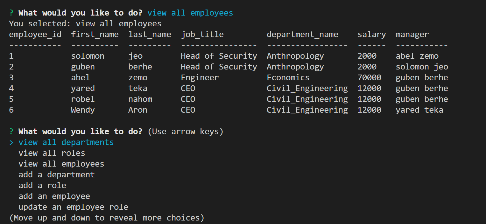
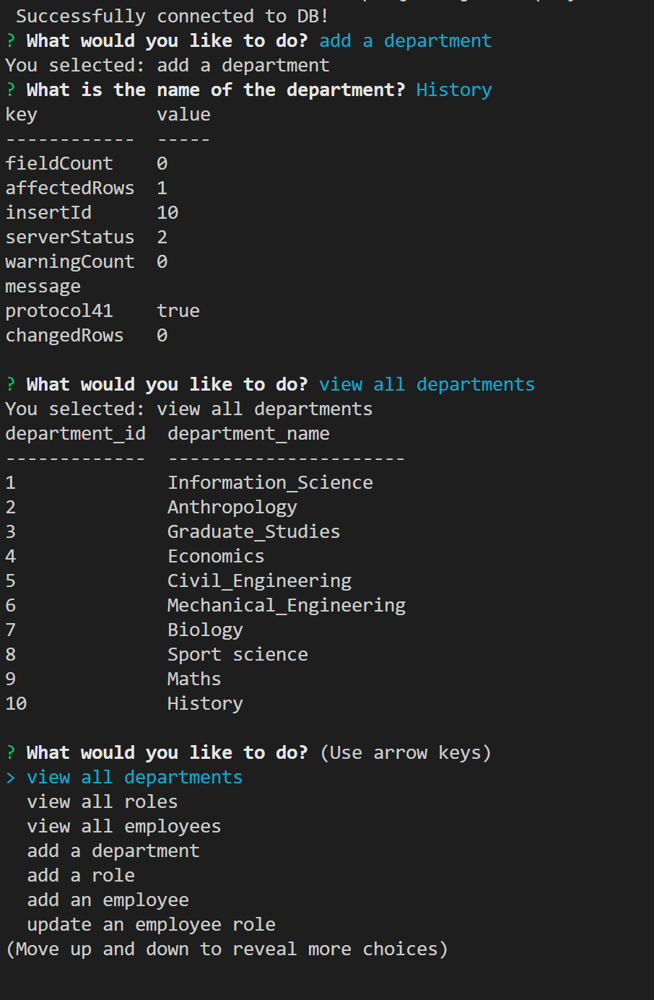
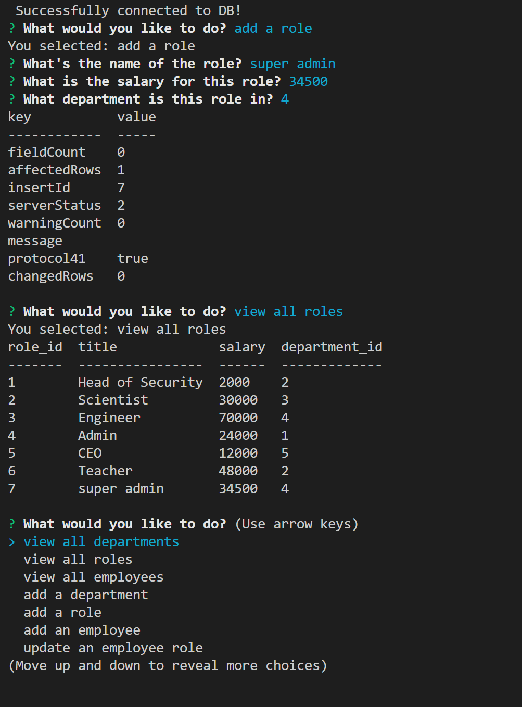
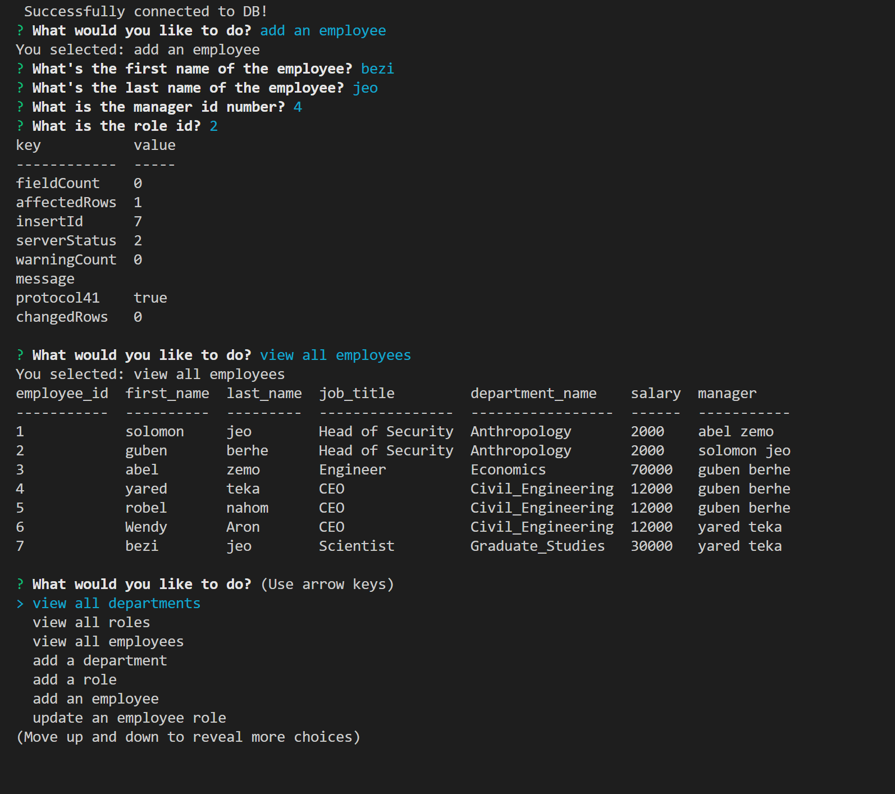
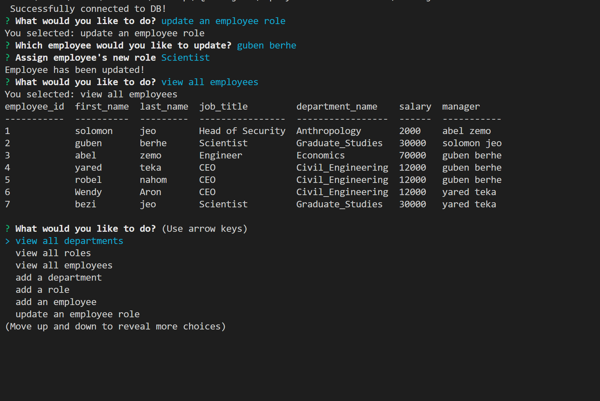

# PSQL Challenge: Employee Tracker

# Description:

build a command-line application from scratch to manage a company's employee database, using Node.js, Inquirer, and MySQL.

        GIVEN a command-line application that accepts user input
        WHEN I start the application
        THEN I am presented with the following options: view all departments, view all roles, view all employees, add a department, add a role, add an employee, and update an employee role
        WHEN I choose to view all departments
        THEN I am presented with a formatted table showing department names and department ids
        WHEN I choose to view all roles
        THEN I am presented with the job title, role id, the department that role belongs to, and the salary for that role
        WHEN I choose to view all employees
        THEN I am presented with a formatted table showing employee data, including employee ids, first names, last names, job titles, departments, salaries, and managers that the employees report to
        WHEN I choose to add a department
        THEN I am prompted to enter the name of the department and that department is added to the database
        WHEN I choose to add a role
        THEN I am prompted to enter the name, salary, and department for the role and that role is added to the database
        WHEN I choose to add an employee
        THEN I am prompted to enter the employee’s first name, last name, role, and manager, and that employee is added to the database
        WHEN I choose to update an employee role
        THEN I am prompted to select an employee to update and their new role and this information is updated in the database

# Technology Used:

* Node JS
* inquirer dependancy 

# Installation

 first of all you need to have Node invironment in your local machine to run javascript file

step 1 : clone my repository to your local machine

step 2 :  open in terminal if you are in mac or linux operating system or in command prompt if you are in window

step 3 : type this command  ( cd Employee-Tracker  ) to navigate to the project

step 4 : type this command ( code .) this helps to open in VS code

step 5 : when you are in VS code click the terminal tab from the VS code to open a terminal from VS code

step 6 : then type git status or git branch and make sure you are on the main branch

step 7 : type this command to install inquirer dependency ( npm i inquirer )

# Usage:

After installation is complete, you should follow those instructions

step 8 : finally type this command (node index.js) and run it .

step 9 : after you run it. it will allow the you to answer a series of specific questions.

step 11: that's it !

# Screenshots:

**Done!  congratulations**

walkthrough video link : https://drive.google.com/file/d/1BkTW7GC3YLcMdp1P_PvU6pnMDVKvCeSY/view

